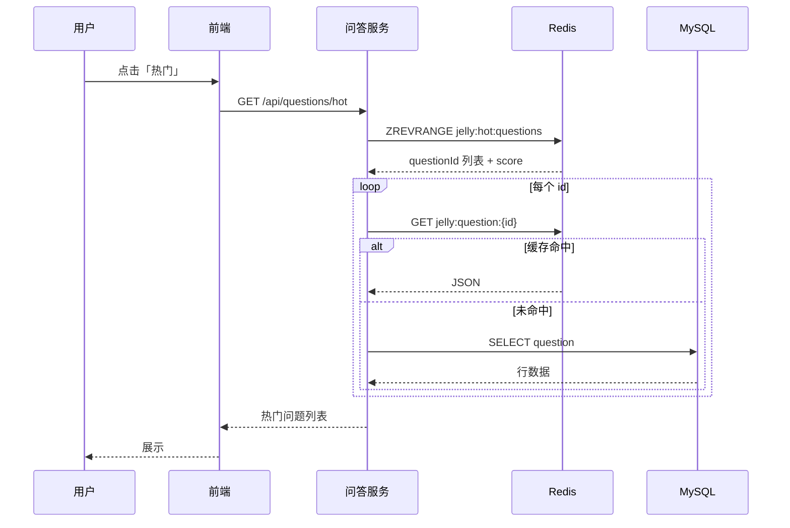
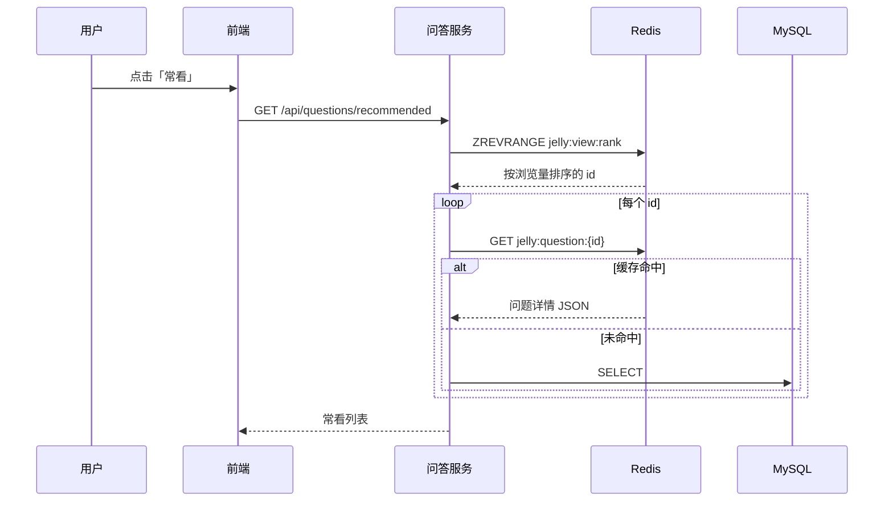
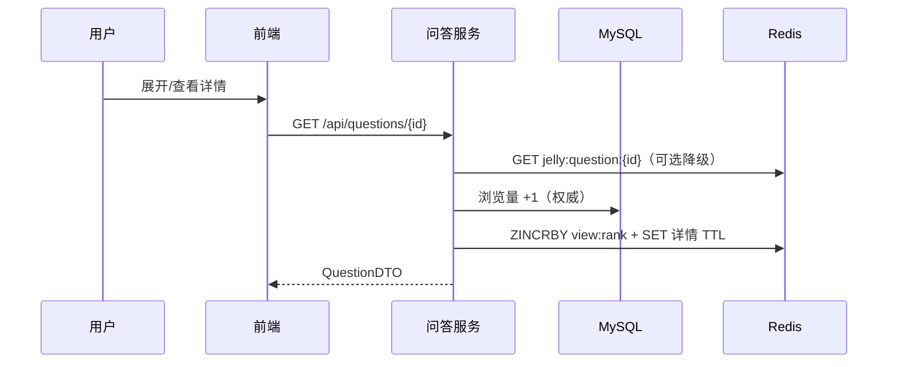
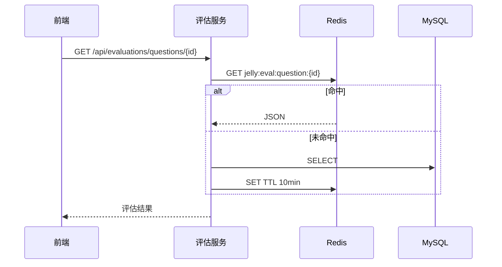

# 第十一周时序图（写报告时复制到 PDF）

## 1. 查询「最受欢迎」问题榜（GET /api/questions/hot）

```mermaid
sequenceDiagram
    participant U as 用户
    participant F as 前端
    participant QA as 问答服务
    participant R as Redis
    participant DB as MySQL

    U->>F: 点击「热门」
    F->>QA: GET /api/questions/hot
    QA->>R: ZREVRANGE jelly:hot:questions
    R-->>QA: questionId 列表 + score
    loop 每个 id
        QA->>R: GET jelly:question:{id}
        alt 缓存命中
            R-->>QA: JSON
        else 未命中
            QA->>DB: SELECT question
            DB-->>QA: 行数据
        end
    end
    QA-->>F: 热门问题列表
    F-->>U: 展示
```

## 2. 查询「最常查看」问题榜（GET /api/questions/recommended）

```mermaid
sequenceDiagram
    participant U as 用户
    participant F as 前端
    participant QA as 问答服务
    participant R as Redis
    participant DB as MySQL

    U->>F: 点击「常看」
    F->>QA: GET /api/questions/recommended
    QA->>R: ZREVRANGE jelly:view:rank
    R-->>QA: 按浏览量排序的 id
    loop 每个 id
        QA->>R: GET jelly:question:{id}
        alt 缓存命中
            R-->>QA: 问题详情 JSON
        else 未命中
            QA->>DB: SELECT
        end
    end
    QA-->>F: 常看列表
```

## 3. 查看问题详情（浏览量 + 写缓存）

```mermaid
sequenceDiagram
    participant U as 用户
    participant F as 前端
    participant QA as 问答服务
    participant DB as MySQL
    participant R as Redis

    U->>F: 展开/查看详情
    F->>QA: GET /api/questions/{id}
    QA->>R: GET jelly:question:{id}（可选降级）
    QA->>DB: 浏览量 +1（权威）
    QA->>R: ZINCRBY view:rank + SET 详情 TTL
    QA-->>F: QuestionDTO
```

## 4. 评估结果读缓存（自设计场景）

```mermaid
sequenceDiagram
    participant F as 前端
    participant EV as 评估服务
    participant R as Redis
    participant DB as MySQL

    F->>EV: GET /api/evaluations/questions/{id}
    EV->>R: GET jelly:eval:question:{id}
    alt 命中
        R-->>EV: JSON
    else 未命中
        EV->>DB: SELECT
        EV->>R: SET TTL 10min
    end
    EV-->>F: 评估结果
```
