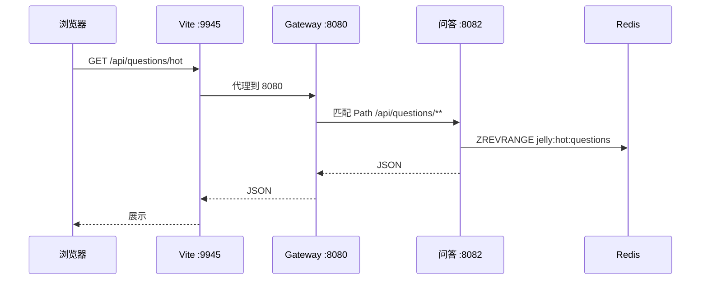

# 进阶学习：Gateway 统一 API + Testcontainers 测 Redis

> 本文对应本次代码改动：**修 update→Redis 同步**、**新增 Gateway 模块**、**Testcontainers 集成测试**、**重写 README**。  
> 目标：既会用，又知道「为什么这样设计」。

---

## 一、你刚学会了什么（总览）

| 改动 | 文件 | 你得到的能力 |
|------|------|-------------|
| 编辑问题同步 Redis | `QuestionServiceImpl.update()` + `QuestionRedisService.onQuestionUpdated()` | 缓存与 DB 一致，不会「改标题后列表还是旧的」 |
| API Gateway | `jellystudy-gateway/` | 一个端口对外，路由集中配置 |
| Testcontainers | `QuestionRedisServiceTestcontainersTest` | 不依赖本机 Redis，CI 也能跑真实 Redis 测试 |
| 前端代理简化 | `frontend/vite.config.js` | 一条 `/api` → Gateway，少记三个端口 |

---

## 二、Bug 修复：update → Redis 同步

### 2.1 之前的问题

```text
用户编辑问题标题
  → MySQL 更新了
  → Redis 里 jelly:question:{id} 还是旧 JSON
  → 热门/常看列表读缓存，显示旧标题（最多等 5 分钟定时任务）
```

### 2.2 修复思路（写穿 Write-Through）

```text
update() 保存 MySQL 成功后
  → onQuestionUpdated(question)
      → upsertRankings()   // updatedAt 变了，热度衰减分数也会变
      → cacheQuestion()    // 覆盖 jelly:question:{id}
```

### 2.3 关键代码

`QuestionRedisService` 抽出公共方法 `syncQuestionToRedis`，创建/更新共用：

```java
public void onQuestionUpdated(Question question) {
    syncQuestionToRedis(question);
}
```

`QuestionServiceImpl.update()` 在 `save` 之后调用：

```java
Question saved = questionRepository.save(updated);
questionRedisService.onQuestionUpdated(saved);
return convertToDTO(saved);
```

### 2.4 自己怎么验证

1. 启动服务，前端改一个问题标题并保存。  
2. 立刻点「热门」或「常看」，看标题是否已更新。  
3. 或 `redis-cli GET jelly:question:<id>` 看 JSON 是否新标题。

### 2.5 还可以怎么练

- 给 `update()` 写一个 **Mockito 单元测试**：verify `questionRedisService.onQuestionUpdated` 被调用一次。  
- 思考：如果 update 只改 `content` 不改 `updatedAt`，衰减分会不会变？（当前代码会 `setUpdatedAt(new Date())`，会刷新「最近」窗口。）

---

## 三、Spring Cloud Gateway：统一 API

### 3.1 为什么需要 Gateway？

**没有 Gateway 时：**

```text
前端要记住：
  知识点  → localhost:8081
  问答    → localhost:8082
  评估    → localhost:8083
Vite 里要写 6 条 proxy 规则
换端口要改前端
```

**有 Gateway 后：**

```text
前端只认：localhost:8080/api/...
Gateway 按路径转发（见 application.yml）
以后加鉴权、限流，只改 Gateway 一处
```

这就是 **BFF/API Gateway 模式** 的入门版。

### 3.2 请求怎么走（以「热门问题」为例）



### 3.3 配置文件在哪

`jellystudy-gateway/src/main/resources/application.yml`

核心结构：

```yaml
spring:
  cloud:
    gateway:
      routes:
        - id: qa-questions
          uri: http://127.0.0.1:8082
          predicates:
            - Path=/api/questions/**
```

- **id**：路由名字，方便日志排查  
- **uri**：下游服务地址  
- **predicates**：什么路径走这条路由  
- **filters / RewritePath**：健康检查把 `/api/health/qa` 改写成下游的 `/api/health`

### 3.4 怎么启动、怎么测

```powershell
# 编译
cd jellystudy-parent
mvn package -pl jellystudy-gateway -am -DskipTests

# 随其他服务一起起（推荐）
powershell -File scripts\start-java-services.ps1

# 手动测
curl http://127.0.0.1:8080/api/health/qa
curl http://127.0.0.1:8080/api/questions/hot
```

查看 Gateway 注册了哪些路由：

http://127.0.0.1:8080/actuator/gateway/routes

### 3.5 前端怎么配合

`vite.config.js` 默认：

```js
proxy: {
  '/api': { target: 'http://127.0.0.1:8080', changeOrigin: true }
}
```

没启 Gateway 时的退路：

```bat
set VITE_DIRECT_BACKEND=true
npm run dev
```

### 3.6 下一步可以学什么

| 进阶 | 做法 |
|------|------|
| 统一鉴权 | Gateway 加 `GlobalFilter` 校验 `X-API-Key` |
| 限流 | `RequestRateLimiter` + Redis |
| 动态路由 | 从 Nacos 读服务实例，uri 用 `lb://jellystudy-qa` |
| HTTPS | Gateway 终结 TLS，后端仍 HTTP |

---

## 四、Testcontainers：真实 Redis 集成测试

### 4.1 为什么不用 `@SpringBootTest` 连本机 Redis？

| 方式 | 问题 |
|------|------|
| 本机 Redis | 同学电脑没装 Redis 就测不了 |
| 嵌入式 Redis 模拟 | 和真 Redis 行为可能有差异 |
| **Testcontainers** | JUnit 运行时 **Docker 里起一个真 Redis**，测完自动销毁 |

### 4.2 测试类结构（逐行理解）

文件：`jellystudy-qa/src/test/.../QuestionRedisServiceTestcontainersTest.java`

```java
@Testcontainers  // 启用 Testcontainers 扩展
class QuestionRedisServiceTestcontainersTest {

    @Container  // JUnit 生命周期：beforeAll 起容器，afterAll 销毁
    static GenericContainer<?> redis = new GenericContainer<>("redis:7-alpine")
            .withExposedPorts(6379);

    @BeforeEach
    void setUp() {
        // 用容器映射端口创建 LettuceConnectionFactory + StringRedisTemplate
        // 手动 new QuestionRedisService（不启整个 Spring Boot）
    }
}
```

** deliberately 不启完整 Spring Boot**：  
QA 模块一启动就要 MySQL、Nacos、Dubbo——慢、脆、难维护。  
我们只测 **Redis 层**，手动 wiring 三个依赖即可。

### 4.3 五个测试各证明什么

| 测试方法 | 证明 |
|----------|------|
| `onQuestionCreated_writesHotZsetAndDetailCache` | 创建问题会写 ZSET + 详情 STRING |
| `onQuestionUpdated_refreshesDetailCache` | **本次 bugfix**：更新后缓存是新标题 |
| `onQuestionViewed_updatesViewRank` | 浏览会更新 view rank |
| `evictQuestion_removesZsetAndCache` | 删除会清干净 |
| `getHotTop_returnsCachedDtoFirst` | 读榜优先走缓存，不回调 MySQL loader |

### 4.4 怎么运行

**前提：Docker Desktop 已启动。**

```bat
cd jellystudy-parent
mvn test -pl jellystudy-qa -Dtest=QuestionRedisServiceTestcontainersTest
```

首次运行会 **pull `redis:7-alpine` 镜像**，稍慢，之后很快。

### 4.5 常见报错

| 报错 | 解决 |
|------|------|
| Could not find Docker environment | 开 Docker Desktop |
| Port already in use | 容器用随机映射端口，一般不会冲突 |
| 测试通过但 IDE 红线 | 正常，Maven 命令行为准 |

### 4.6 下一步可以学什么

```java
// 1. 加 @ServiceConnection + @SpringBootTest（Spring Boot 3.1+ 更简写法）
// 2. Testcontainers 起 MySQL，测 QuestionServiceImpl 全链路
// 3. GitHub Actions: services: docker + mvn test
```

---

## 五、Maven 依赖你加了什么

**父 POM `jellystudy-parent/pom.xml`：**

```xml
<spring-cloud.version>2023.0.3</spring-cloud.version>
<testcontainers.version>1.20.4</testcontainers.version>
<!-- import spring-cloud-dependencies + testcontainers-bom -->
```

**QA 模块测试依赖：**

```xml
<dependency>
    <groupId>org.testcontainers</groupId>
    <artifactId>junit-jupiter</artifactId>
    <scope>test</scope>
</dependency>
```

**Gateway 模块：**

```xml
<dependency>
    <groupId>org.springframework.cloud</groupId>
    <artifactId>spring-cloud-starter-gateway</artifactId>
</dependency>
```

---

## 六、学习路线建议（按周）

| 周 | 任务 | 对应本项目 |
|----|------|-----------|
| 1 | 跑通 Testcontainers 单测 | 本文第四节 |
| 2 | 手改 Gateway 加一条 `/api/foo` 路由 | application.yml |
| 3 | 给 Gateway 写 GlobalFilter 打印请求日志 | 新建 `LoggingFilter.java` |
| 4 | Mockito 测 `QuestionServiceImpl.update` | 新测试类 |
| 5 | GitHub Actions：`mvn test` + Docker | `.github/workflows/ci.yml` |

---

## 七、答辩 / 简历可以怎么说

**Gateway：**  
「前端通过 Spring Cloud Gateway 统一访问 8080，按路径转发到 knowledge/qa/evaluate 三个微服务，便于后续集中做鉴权和限流。」

**Testcontainers：**  
「Redis 排行榜逻辑用 Testcontainers 在 CI 里起真实 Redis 容器做集成测试，不依赖开发者本机环境。」

**update 同步：**  
「问题编辑采用写穿策略，MySQL 更新后立即刷新 Redis ZSET 与详情缓存，避免列表展示 stale 数据。」

---

## 八、Gateway 鉴权 Filter（新增）

### 8.1 文件

| 文件 | 作用 |
|------|------|
| `ApiKeyGatewayFilter.java` | 全局 Filter，校验 `X-API-Key` |
| `GatewayAuthProperties.java` | `enabled` / `api-key` 配置 |
| `GatewayPingController.java` | 自检 `GET /api/gateway/ping`（白名单，不鉴权） |

### 8.2 默认行为（开发）

`JELLYSTUDY_GATEWAY_AUTH_ENABLED=false`（默认）→ **不拦截**，和之前一样随便调。

### 8.3 开启鉴权后怎么测

```bat
set JELLYSTUDY_GATEWAY_AUTH_ENABLED=true
set JELLYSTUDY_GATEWAY_API_KEY=my-dev-key
java -jar jellystudy-gateway/target/jellystudy-gateway-1.0.0-SNAPSHOT.jar
```

```bat
:: 无 Key → 401
curl http://127.0.0.1:8080/api/questions/hot

:: ping 白名单 → 200
curl http://127.0.0.1:8080/api/gateway/ping

:: 带 Key → 200（需下游 8082 已启动）
curl -H "X-API-Key: my-dev-key" http://127.0.0.1:8080/api/questions/hot
```

### 8.4 和下游 ApiKeyAuthFilter 的关系

Gateway 是第一道门；若下游也开 `JELLYSTUDY_SECURITY_ENABLED=true`，前端需**同一把 Key** 透传 `X-API-Key`（Gateway 不会自动加，需前端或 Gateway 加 RequestHeader Filter 扩展）。

---

## 九、GitHub Actions CI（新增）

文件：`.github/workflows/ci.yml`

推送到 `main` 后自动：

1. `mvn package` 编译  
2. 跑 Redis Testcontainers 测试（GitHub 自带 Docker，**比本机 Cursor 终端更稳**）  
3. 编译 Gateway  

上传前阅读：`docs/GITHUB上传指南.md`

---

## 十、三项巩固实验（你怎么跑、我替你跑了什么）

### 实验 1：Testcontainers 5 passed

**本机 Cursor 终端**：Docker Desktop 在跑，但 Java Testcontainers 连 npipe 有时 400 → 测试被 **Skipped**（设计如此，不失败）。

**请你在外部 CMD 跑（更容易绿）：**

```bat
cd jellystudy-parent
tools\..\tools\apache-maven-3.9.6\bin\mvn.cmd test -pl jellystudy-qa -Dtest=QuestionRedisServiceTestcontainersTest
```

期望：`Tests run: 5, Failures: 0, Skipped: 0`

**GitHub Actions**：push 后在 Actions 页看 CI 绿勾 = 云端 5 passed。

**`onQuestionUpdated_refreshesDetailCache` 测试** = 代码级证明「改标题 → Redis 缓存更新」，等价于前端改标题实验。

### 实验 2：Gateway ping（已替你 curl 成功）

```bat
curl http://127.0.0.1:8080/api/gateway/ping
```

返回 JSON：`service=jellystudy-gateway, status=ok` —— 说明 Gateway 在跑，且 **ping 路由不转发下游**。

### 实验 3：前端改标题 → 热门列表

需 **MySQL + Nacos + QA + Gateway + 前端** 全栈。快速验证命令（QA 起来后）：

```bat
:: 1. 记一个 question id
curl http://127.0.0.1:8080/api/questions/hot

:: 2. PUT 改标题（示例）
curl -X PUT http://127.0.0.1:8080/api/questions/<id> -H "Content-Type: application/json" -d "{\"title\":\"新标题测试\",\"content\":\"正文\"}"

:: 3. 再看 hot 列表或 Redis
docker exec jellystudy-redis redis-cli -a jellystudy_redis GET jelly:question:<id>
```

若 `GET` 里已是 `"title":"新标题测试"` → update→Redis 同步成功。

---

## 十一、相关文件速查

| 文件 | 作用 |
|------|------|
| `QuestionRedisService.java` | Redis 读写核心 |
| `QuestionServiceImpl.java` | update 触发 onQuestionUpdated |
| `QuestionRedisServiceTestcontainersTest.java` | Redis 集成测试 |
| `jellystudy-gateway/application.yml` | 路由表 |
| `frontend/vite.config.js` | 前端 → Gateway 代理 |
| `scripts/start-java-services.ps1` | 启动四服务含 Gateway |
| `README.md` | 项目总入口 |

有问题继续问；下一关推荐：**Gateway 鉴权 Filter** 或 **GitHub Actions CI**。
