# JellyStudy 实验报告（第九周微服务 + 第十一周 Redis）

**学号**：32308117  
**姓名**：吕宇轩  
**工程名**：jellystudy  

---

## 一、实验目的

1. 在 JellyStudy 问答平台中引入 **Redis**，实现热门榜、常看榜与自设计读缓存场景。  
2. 完成 **Redis 结构设计**、**时序图**与**可运行代码**，并能通过前端与 `redis-cli` 验证。  
3. 延续第九周：**Dubbo + Nacos** 微服务拆分，问答服务异步调用评估服务（通义千问 / Mock 降级）。

---

## 二、实验环境

| 组件 | 版本 / 说明 |
|------|-------------|
| JDK | 17 |
| Spring Boot | 3.2.11 |
| Apache Dubbo | 3.2.7 |
| Nacos | 2.2.3（Docker，`nacos/nacos`） |
| MySQL | 8.x（Docker 映射 **3307**，库 `jellystudy`、`jellystudy_evaluate`） |
| Redis | 7.x（Docker，密码 `jellystudy_redis`） |
| 前端 | Vue 3 + Vite 6，端口 **9945** |
| 可选 | SkyWalking OAP/UI **8090**，Java Agent 挂三服务 |

**服务端口**：知识点 8081、问答 8082、评估 8083。

---

## 三、系统架构简述

```
前端(9945) ──HTTP──► 知识点(8081) / 问答(8082) / 评估(8083)
                              │
                    Dubbo + Nacos(8848)
                              │
              MySQL(业务+评估)    Redis(排行榜+详情+评估缓存)
```

- **问答服务**：问题/回答 CRUD、Redis 排行榜、浏览量写 MySQL 后同步 Redis。  
- **评估服务**：大模型评估（DashScope 千问），结果入 MySQL，读路径可走 Redis 缓存。  
- **删除问题**：问答服务经 Dubbo 级联删除评估记录，并清理 Redis 评估缓存。

---

## 四、Redis 数据结构设计

| Key | 类型 | 说明 | TTL |
|-----|------|------|-----|
| `jelly:hot:questions` | ZSET | **最受欢迎榜**：member=questionId，score=热度分 | 持久 |
| `jelly:view:rank` | ZSET | **最常查看榜**：member=questionId，score=累计浏览量 | 持久 |
| `jelly:question:{id}` | STRING | 问题详情 JSON，降低列表补全时的 DB 压力 | 30 分钟 |
| `jelly:eval:question:{id}` | STRING | 问题评估结果 JSON（**自设计场景**） | 10 分钟 |
| `jelly:eval:answer:{id}` | STRING | 答案评估结果 JSON（**自设计场景**） | 10 分钟 |

### 4.1 「最受欢迎」定义（场景 1）

- **基础热度**：`点赞数×3 + 回答数×2 + 浏览数×0.1`（`QuestionRankScoring`）。  
- **时间窗口**：仅 `updatedAt`（无则 `createdAt`）在 **最近 7 天** 内的问题进入 ZSET（`jellystudy.redis.recent-window-days`）。  
- **衰减**：在窗口内按天数衰减，`score = 基础热度 × (1 - 天数×0.85/7)`；超出窗口 score=0 并从榜移除。  
- **接口**：`GET /api/questions/hot` → `ZREVRANGE jelly:hot:questions`。

### 4.2 「最常查看」定义（场景 2）

- **score**：问题累计 `view_count`（MySQL 为权威，每次 `GET /api/questions/{id}` 时 +1 再写回 Redis）。  
- **接口**：`GET /api/questions/recommended` → `ZREVRANGE jelly:view:rank`。  
- **详情缓存**：写浏览后 `SET jelly:question:{id}`，热门/常看列表优先读缓存，未命中再查 MySQL。

### 4.3 自设计场景（场景 3）

- **目标**：评估结果查询频繁、表在独立库 `jellystudy_evaluate`，用 Redis 降低重复 SELECT。  
- **策略**：`GET /api/evaluations/questions/{id}` 先 `GET jelly:eval:question:{id}`，未命中查库并 `SET`（TTL 10min）；列表加载时批量预热问题评估缓存。  
- **失效**：按 questionId/answerId 删除评估时 `DEL` 对应 key。

---

## 五、缓存 / 数据同步策略

| 策略 | 说明 | 代码位置 |
|------|------|----------|
| 写穿 | 创建问题、点赞、回答数变更、浏览 +1 时同时更新 MySQL 与 Redis ZSET/STRING | `QuestionRedisService` |
| 启动预热 | QA 服务启动后从 MySQL 全量重建 ZSET | `QuestionRankSyncScheduler`（启动） |
| 定时对齐 | 每 **5 分钟** 全量同步排行榜，防止 Redis 与库表漂移 | `QuestionRankSyncScheduler` |
| 空榜兜底 | 访问 hot/recommended 时若 ZSET 为空则 rebuild | `QuestionServiceImpl.ensureRankingsWarm` |
| 删除级联 | 删问题 → Dubbo 删评估 + 删回答；`evictQuestion` 移除 ZSET 与详情缓存 | `QuestionServiceImpl.delete` |

---

## 六、时序图

> 下图已预渲染为 PNG（`docs/diagrams/`），在 Cursor/VS Code 预览与导出 PDF 时均可直接显示。若需修改流程，可运行 `node scripts/render-mermaid-diagrams.mjs` 重新生成。

### 6.1 查询最受欢迎榜

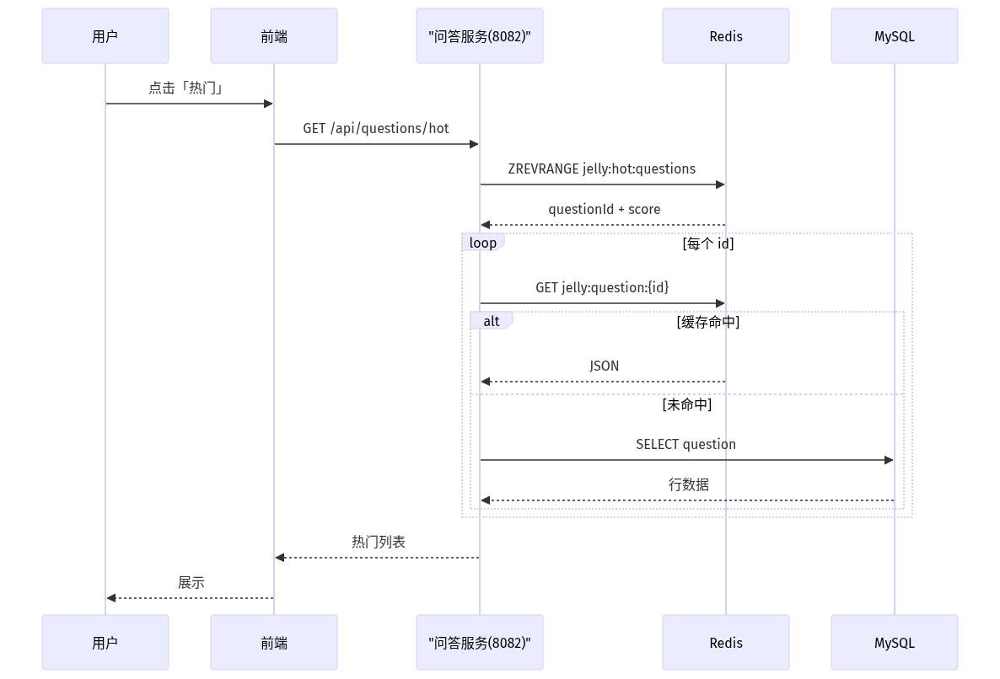

### 6.2 查询最常查看榜

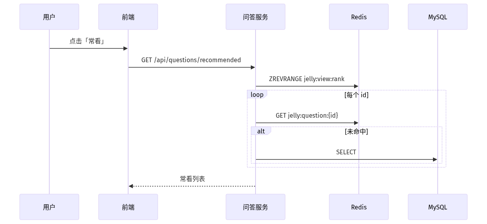

### 6.3 查看问题详情（浏览量 + 缓存）

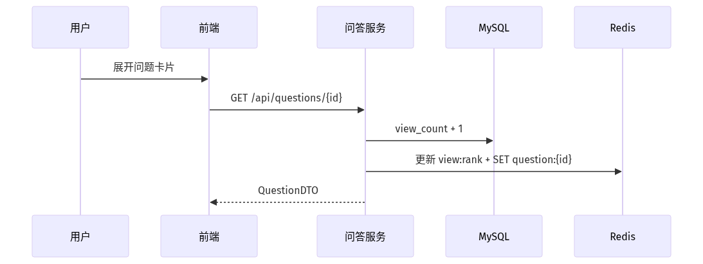

### 6.4 创建问题并异步评估（第九周）

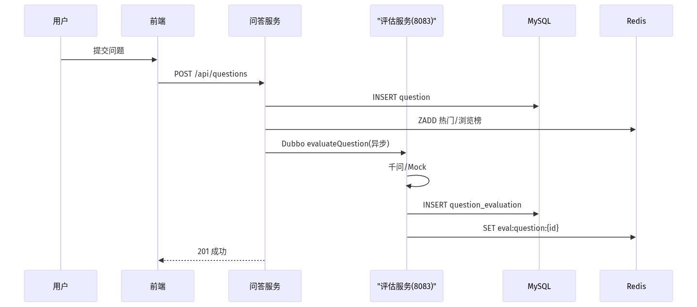

### 6.5 评估结果读缓存（自设计）

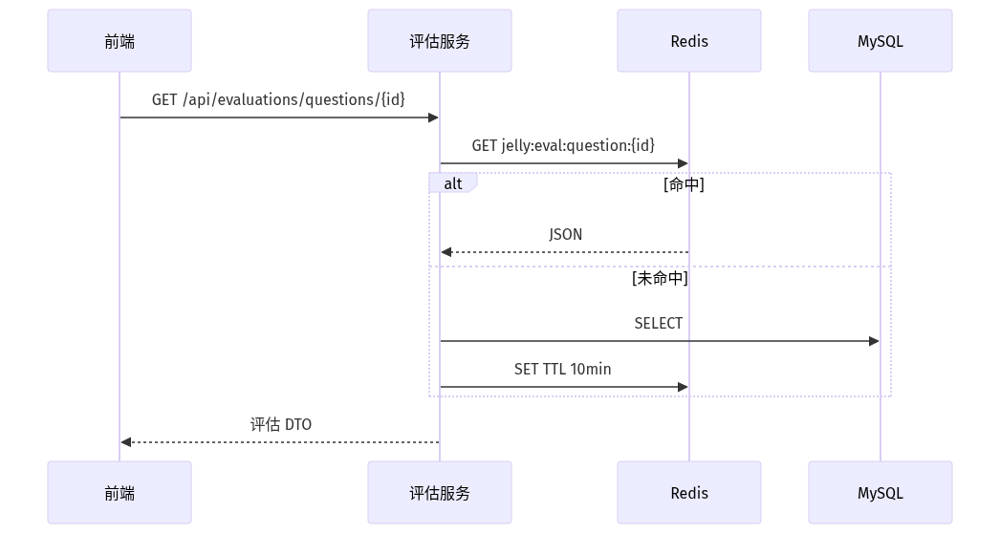

---

## 七、核心代码说明

| 模块 | 类 / 文件 | 职责 |
|------|-----------|------|
| QA | `QuestionRedisService` | ZSET/STRING 读写、热度计算、evict |
| QA | `QuestionRankSyncScheduler` | 启动 + 定时 5min 全量同步 |
| QA | `QuestionServiceImpl.getById` | 浏览量 MySQL +1，同步 Redis |
| Evaluate | `EvaluationRedisCache` | 评估读缓存、失效 |
| Common | `JellystudyHealthController` | `GET /api/health` 供前端探活 |
| 前端 | `healthCheck.js` | 每 15s 探测 8081/8082/8083 |

---

## 八、运行与验证

### 8.1 启动顺序

```bat
docker compose -f docker-compose.core.yml up -d
cd jellystudy-parent && mvn clean package -DskipTests
powershell -File scripts\start-java-services.ps1
cd frontend && npm run dev
```

浏览器：**http://127.0.0.1:9945/**（支持 `#evaluation` 等 Hash 刷新不丢页）。

### 8.2 Redis 验证命令

```bat
docker exec jellystudy-redis redis-cli -a jellystudy_redis ZREVRANGE jelly:hot:questions 0 5 WITHSCORES
docker exec jellystudy-redis redis-cli -a jellystudy_redis ZREVRANGE jelly:view:rank 0 5 WITHSCORES
docker exec jellystudy-redis redis-cli -a jellystudy_redis GET jelly:question:<问题UUID>
```

### 8.3 健康检查

```text
GET http://localhost:8081/api/health
GET http://localhost:8082/api/health
GET http://localhost:8083/api/health
```

前端侧栏应显示三服务绿点及「已连接」（三服务均启动时）。

### 8.4 功能自测清单

- [ ] 知识点增删改查  
- [ ] 提问后「智能评估」出现记录（千问或 Mock）  
- [ ] 问题列表「热门」「常看」有数据  
- [ ] **展开问题**后浏览量增加  
- [ ] 删除问题后评估列表同步消失  
- [ ] Nacos 可见三个 Provider  
- [ ] SkyWalking Service + Trace（图 6、`06-skywalking-trace-evaluate`）  
- [ ] DBeaver 评估库与表结构（图 8、`08-db-evaluation-schema`）  

---

## 九、运行效果截图

> **操作说明**：逐步截图方法见 [`docs/截图操作指南.md`](docs/截图操作指南.md)。  
> **存放路径**：将 PNG 保存到 `docs/screenshots/`，文件名必须与下表一致。  
> 放好后本报告中的图片会自动显示；导出 PDF 前请预览一遍。

### 9.1 截图一览

| 序号 | 文件名 | 对应实验要求 |
|------|--------|----------------|
| 1 | `01-nacos-services.png` | 微服务注册（Dubbo + Nacos） |
| 2 | `02-question-hot-viewed.png` | Redis 热门榜 / 常看榜（要求 1、2 前端验证） |
| 3 | `03-evaluate-qianwen.png` | 大模型评估展示（第九周） |
| 4 | `04-redis-hot-zset.png` | Redis ZSET `jelly:hot:questions`（要求 1） |
| 5 | `05-redis-view-zset.png` | Redis ZSET `jelly:view:rank`（要求 2） |
| 6 | `06-skywalking-services.png` | SkyWalking 服务级监控（三服务 Load/Latency） |
| 6b | `06-skywalking-trace-evaluate.png` | SkyWalking Trace：Dubbo 问题评估约 2s + 落库/Redis |
| 7 | `07-frontend-health.png` | 三服务 `/api/health` 探活 |
| 8 | `08-db-evaluation.png` | 评估库 `jellystudy_evaluate` 及两张评估表（有数据） |
| 8b | `08-db-evaluation-schema.png` | `question_evaluation` 表结构 |

### 9.2 图 1 — Nacos 服务注册

**怎么截**：浏览器打开 http://127.0.0.1:8848/nacos（`nacos` / `nacos`）→ **服务管理 → 服务列表** → 截到三个服务名。

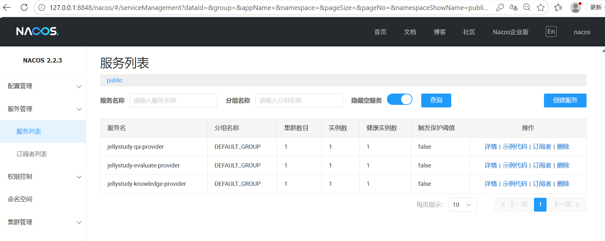

### 9.3 图 2 — 问题页「热门 / 常看」

**怎么截**：http://127.0.0.1:9945/#question → 点击 **热门** 或 **常看**，画面含筛选按钮、问题列表及 **浏览** 数。

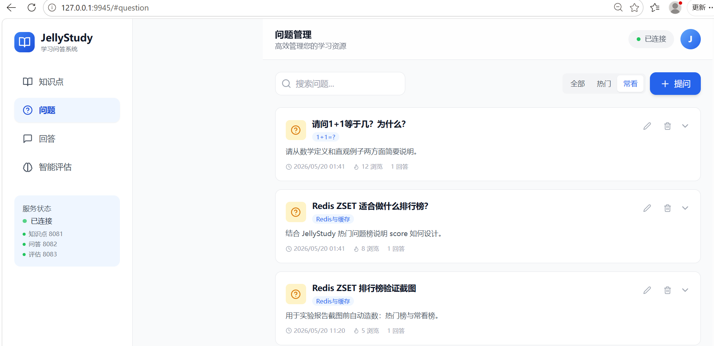

### 9.4 图 3 — 智能评估结果

**怎么截**：http://127.0.0.1:9945/#evaluation → **问题评估** Tab → 选一条含评估详情与知识点标签的记录。

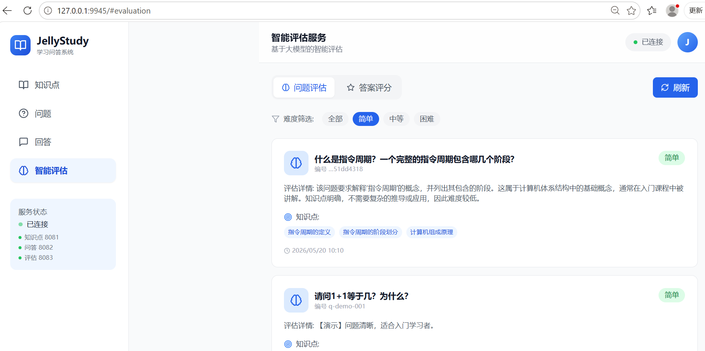

### 9.5 图 4 — Redis 最受欢迎榜（要求 1）

**怎么截**：终端执行后截屏（需有 score 输出）：

```bat
docker exec jellystudy-redis redis-cli -a jellystudy_redis ZREVRANGE jelly:hot:questions 0 5 WITHSCORES
```

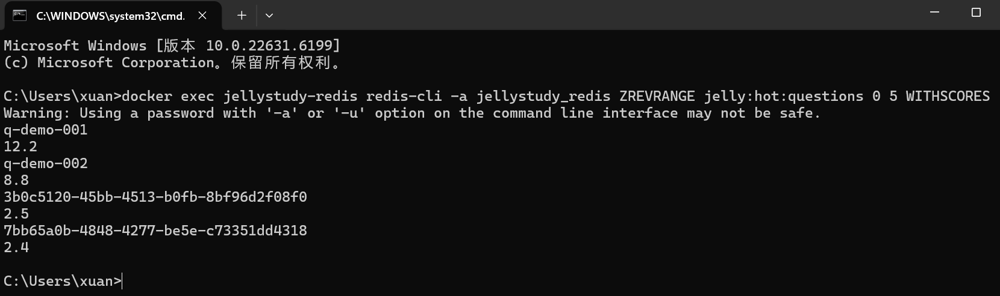

### 9.6 图 5 — Redis 最常查看榜（要求 2）

**怎么截**：

```bat
docker exec jellystudy-redis redis-cli -a jellystudy_redis ZREVRANGE jelly:view:rank 0 5 WITHSCORES
```

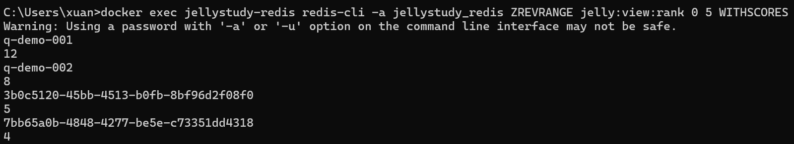

### 9.7 图 6 — SkyWalking 服务监控

**怎么截**：http://127.0.0.1:8090/ → 先操作前端产生流量 → **General-Root → Service** 页看到三个 `jellystudy-*` 服务及 Load/Latency。

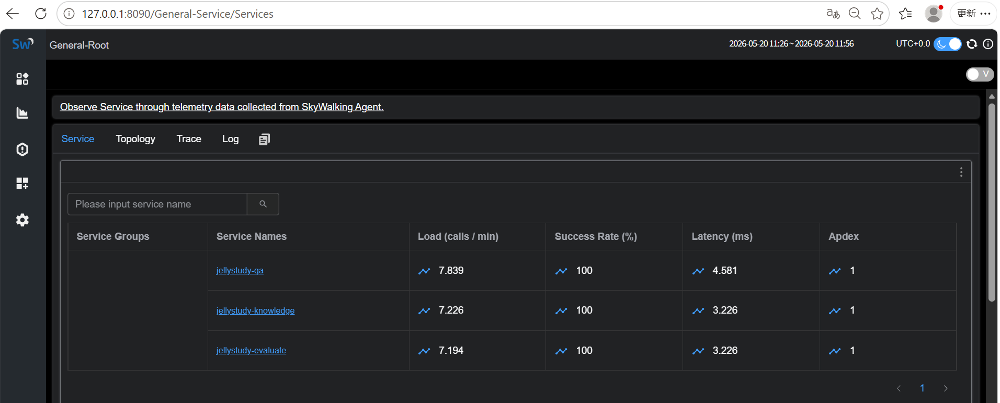

### 9.7b 图 6-补充 — SkyWalking Trace（问题评估调用链）

**说明**：图 6 为服务级汇总；本图为**单次** `evaluateQuestion` 链路。左侧选中约 **2000ms** 的 Dubbo 记录（勿选 `GET:/api/health` 的 3ms）。右侧可见评估结束后 **MySQL 写入** 与 **Redis SETEX**（评估读缓存），总耗时秒级，与通义千问 API 调用特征一致，可与图 3 对照。

**怎么截**：http://127.0.0.1:8090/ → **Trace** → 点 `IEvaluateService.evaluateQuestion`（约 2046ms）→ 截右侧 Span 时间线。

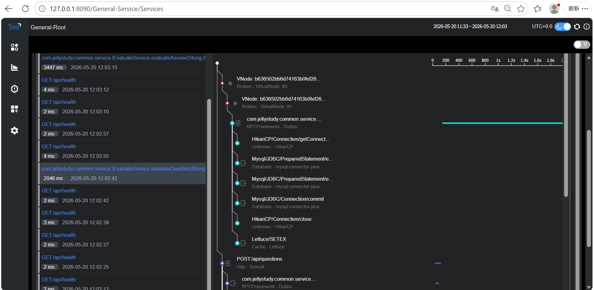

### 9.8 图 7 — 前端服务探活

**怎么截**：前端任意页 → 左侧 **服务状态：已连接** 及 8081/8082/8083 三行绿点。

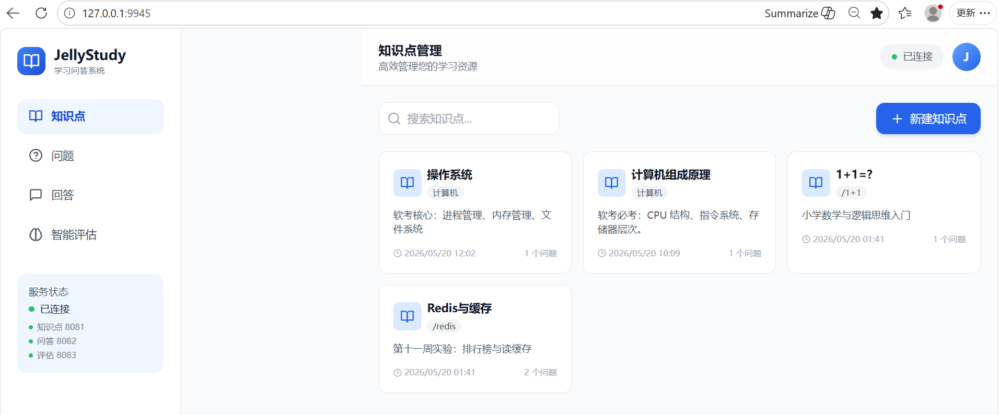

### 9.9 图 8 — 评估结果持久化（MySQL）

**连接**：`127.0.0.1:3307`，用户 `root`，密码 `123456`。业务数据在库 `jellystudy`；大模型评估结果在库 **`jellystudy_evaluate`**，主要表为 `question_evaluation`、`answer_evaluation`。

**怎么截（DBeaver）**：连接成功后展开 `jellystudy_evaluate`，截库内两张表及数据大小（各约 16K，表示已有评估记录）。

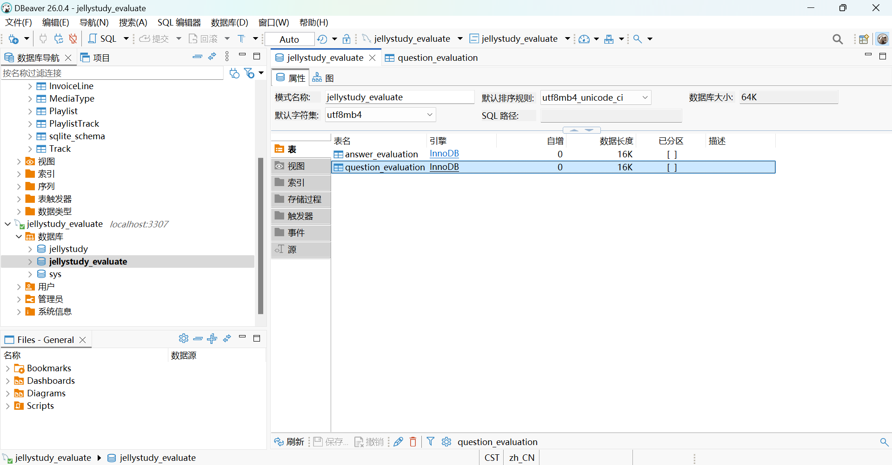

### 9.9b 图 8-补充 — `question_evaluation` 表结构

表中包含 `question_id`、`knowledge_points`、`difficulty`、`evaluation_details`、`created_at` 等字段，与评估服务实体及千问返回 JSON 字段一致。

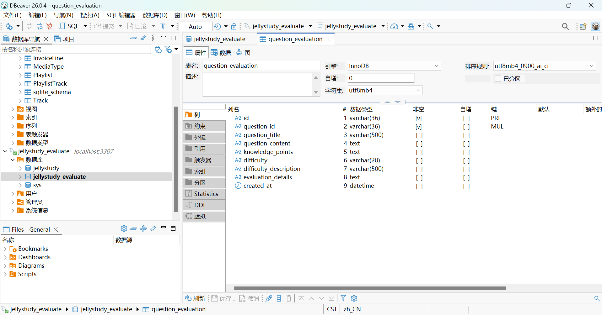

---

## 十、实验总结

1. **Redis 三场景**均已落地：热门 ZSET（带 7 天窗口与衰减）、常看 ZSET + 详情 STRING、评估读缓存 STRING；并通过写穿 + 定时任务保证与 MySQL 一致。  
2. **读路径分层**：排行榜类高频读走 Redis；浏览量以 MySQL 为准再同步 Redis，避免纯缓存丢计数。  
3. **微服务协作**：问答服务通过 Dubbo 触发评估，删除时级联清理评估库与 Redis，避免脏数据。  
4. **可运维性**：统一 `/api/health` 与前端探活；SkyWalking Service 展示三服务存活，Trace 展示单次 `evaluateQuestion` 约 2s 及 MySQL/Redis 落库，与健康检查（约 3ms）区分。  

**体会**（可手写补充）：通过 ZSET 实现排行榜比关系型排序查询更轻量；同时需设计同步与 TTL，否则会出现榜与库不一致——本项目用写穿 + 5 分钟全量对齐作为折中方案。

---

## 附录：提交物清单

| 文件 | 说明 |
|------|------|
| `32308117_吕宇轩.pdf` | 本报告导出 |
| `32308117_jellystudy.zip` | `package-project.bat` 打包（不含 target/node_modules） |
| 源代码 | `jellystudy-parent/` + `frontend/` + `init-database.sql` + `docker-compose.core.yml` |
