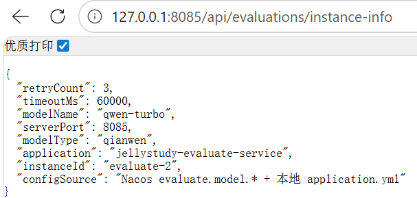
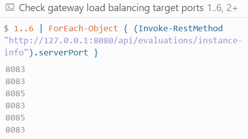
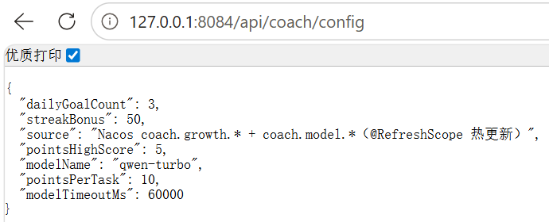
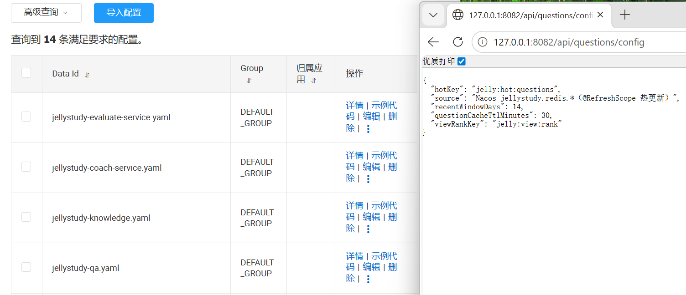
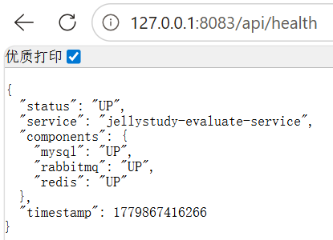
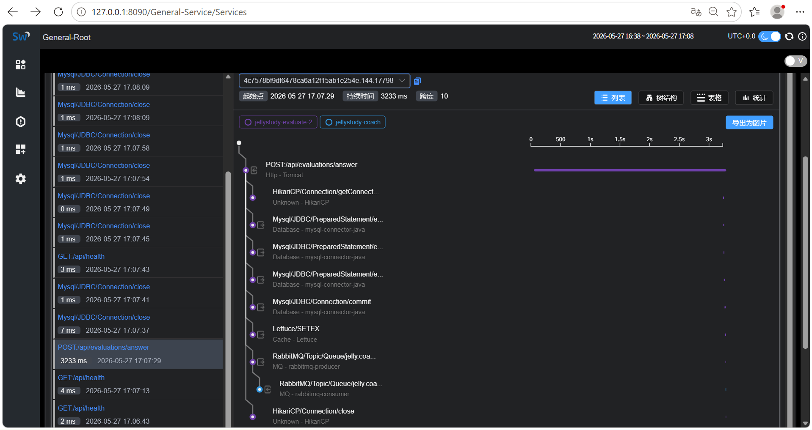

# 移动应用系统架构设计 — 实验报告（第十二周）

**课程号**：C01215  
**实验名称**：微服务容器化与部署实验  
**学号**：32308117  
**姓名**：吕宇轩  
**工程名**：jellystudy  
**实验日期**：2026 年 5 月  

> **Word 模板对照**：本文档章节已与学校模板 **一至七** 对齐，复制到 Word 时按标题「一、二、三…」粘贴即可，无需改章节号。

---

## 一、实验目的

1. 掌握 **Docker** 打包与部署，实现**一个微服务两个实例**（评估服务 evaluate-1 / evaluate-2）。
2. 掌握 **Nacos 配置中心**，实现业务参数（含 **AI 大模型**相关配置）的动态读取与**热更新**（改配置不重启服务）。
3. 在 JellyStudy 平台上**设计并实现独立模块 JellyCoach 智能成长教练**，综合运用 Spring Boot、Dubbo 3、MongoDB、Redis、RabbitMQ、DashScope 千问、SkyWalking 调用链与 Docker。
4. 理解 **Dubbo 3 元数据注册**（registry + metadata-report + config-center）的标准化流程。

---

## 二、实验环境

| 组件 | 版本 / 端口 |
|------|-------------|
| JDK | 17 |
| Spring Boot | 3.2.11 |
| Spring Cloud | 2023.0.3 |
| Apache Dubbo | 3.2.7（Triple 协议） |
| Nacos | 2.2.3（Docker :8848，`nacos`/`nacos`） |
| MySQL | 8.0（Docker :3307） |
| Redis | 7（Docker :6379，密码 `jellystudy_redis`） |
| MongoDB | 7（Docker :27017，库 `jellystudy_coach`） |
| RabbitMQ | 3（:5672，管理台 :15672） |
| SkyWalking | OAP/UI :8090 |
| Gateway | 8080（评估路由 `lb://jellystudy-evaluate`，profile `dual` 轮询 8083+8085） |
| Evaluate | **8083**、**8085**（双实例） |
| Coach | 8084 |
| QA / Knowledge | 8082 / 8081 |
| 前端 | Vue 3 + Vite :9945 |
| 大模型 | 阿里云 DashScope 千问（`qwen-turbo`，Mock 降级） |

---

## 三、实验内容与原理

### 3.1 Docker 双实例原理

同一镜像 `jellystudy-evaluate-service` 通过环境变量 `INSTANCE_ID`、`SERVER_PORT`、`DUBBO_PROTOCOL_PORT` 区分两个进程/容器。Gateway 使用 `application-dual.yml`，通过 Spring Cloud LoadBalancer 在 **8083** 与 **8085** 间轮询；Dubbo 层两个 Provider 同时注册 Nacos，QA 调用 `IEvaluateService` 时由客户端负载均衡。

| 实例 | INSTANCE_ID | SERVER_PORT | DUBBO 端口 |
|------|-------------|-------------|------------|
| evaluate-1 | evaluate-1 | 8083 | 50053 |
| evaluate-2 | evaluate-2 | 8085 | 50055 |

### 3.2 Nacos 配置中心原理

各服务通过 `spring.config.import` 拉取 Nacos 上的 yaml；业务类使用 `@ConfigurationProperties` + `@RefreshScope` 绑定参数。Nacos 控制台修改并发布后，服务**无需重启**即可读到新值（即「热更新」）。

```yaml
spring:
  config:
    import:
      - optional:nacos:${spring.application.name}.yaml?group=DEFAULT_GROUP&refreshEnabled=true
```

| Data ID | 关键参数 | 业务用途 |
|---------|----------|----------|
| `jellystudy-evaluate-service.yaml` | `evaluate.model.*` | 千问/Mock、超时 |
| `jellystudy-coach-service.yaml` | `coach.growth.*` | 每日任务数、积分规则 |
| `jellystudy-knowledge.yaml` | `knowledge.list.max-list-size` | 知识点列表上限 |
| `jellystudy-qa.yaml` | `jellystudy.redis.recent-window-days` | 热门/常看榜时间窗 |

### 3.3 Dubbo 3 与 JellyCoach 业务原理

- **Dubbo 3**：应用级服务发现（`register-mode: instance`），registry + metadata-report + config-center 三元组注册至 Nacos。
- **JellyCoach**：评估完成 → RabbitMQ 事件 → Coach 消费 → 更新 MongoDB 成长档案与 Redis 任务/排行 → 前端展示宠物与周报。

---

## 四、系统设计

> **本章对应模板**：撰写实验设计及相关设计图。

### 4.1 系统总体架构

```text
浏览器 :9945
    │ Bearer Token
    ▼
Gateway :8080  ──lb──► Evaluate :8083 / :8085（双实例）
    ├─► Knowledge :8081
    ├─► QA :8082 ──Dubbo──► Evaluate（异步评估）
    └─► Coach :8084
              ▲
              │ RabbitMQ jelly.coach.evaluation.completed
         Evaluate 评估完成发布事件
              ├──► DashScope（千问）
              ├──► MongoDB（档案/宠物/Quiz）
              ├──► Redis（任务/打卡/排行）
              └──► Dubbo ──► Knowledge（知识点白名单）

基础设施：MySQL | Redis | Nacos | MongoDB | RabbitMQ | SkyWalking
```

**图 4-1** 系统总体架构（答辩时可插入上述示意图或自绘 Visio 图）

### 4.2 Docker 双实例部署设计

- **编排文件**：`docker-compose.core.yml`（中间件）+ `docker-compose.services.yml`（Java 服务）。
- **镜像**：统一 `docker/Dockerfile.jvm-service`，内置 SkyWalking Agent。
- **负载**：HTTP 走 Gateway `lb://jellystudy-evaluate`；Dubbo 走 Nacos 多实例发现。
- **本地演示**：`scripts/start-full-stack.ps1` 启动五服务 + evaluate-2 + Gateway `dual` profile。

**图 4-2** Docker 双实例部署示意（截图：`z12-docker-ps.png` 或 `z12-gateway-lb.png`）

### 4.3 Nacos 配置管理设计

- **配置模板**：`nacos-config/*.yaml`，脚本 `scripts/import-nacos-config.ps1` 一键推送。
- **读取类**：`EvaluateModelProperties`、`CoachGrowthProperties`、`JellystudyRedisProperties`、`KnowledgeListProperties` 等。
- **对外暴露**：各服务提供 `/config` 或 `instance-info` 接口，便于验收与截图。
- **密钥隔离**：`DASHSCOPE_API_KEY` 仅环境变量注入，不写入 Nacos。

**图 4-3** Nacos 配置列表（截图：`z12-nacos-config.png`）

### 4.4 JellyCoach 独立模块设计

**模块定位**：独立于用户管理、权限管理、知识点管理、QA 的第五大微服务（端口 8084）。登录鉴权为平台基础设施，详见 `docs/平台认证与JellyCoach模块边界.md`。

| 编号 | 功能 | 技术要点 |
|------|------|----------|
| F1 | 学情画像 | AI 薄弱点 Top3 |
| F2 | 每日任务 | Nacos 配置任务数 + Redis 缓存 |
| F3 | AI 巩固出题 | DashScope |
| F4 | AI 练习批改 | 打分 + 积分 |
| F5 | 学习周报 | Markdown + 趋势图 |
| F6 | 知识宠物 | MongoDB 状态机 |
| F7 | 苏格拉底对话 | 多轮 AI + MongoDB 存会话 |
| F8 | 排行榜 | Redis ZSET |

**图 4-4** JellyCoach 前端界面（截图：`z12-coach-panel.png`）

### 4.5 微服务与中间件划分设计

| 模块 | 端口 | 存储 | 对外能力 |
|------|------|------|----------|
| Gateway | 8080 | — | 统一入口、负载均衡 |
| Knowledge | 8081 | MySQL | 知识点 Dubbo Provider |
| QA | 8082 | MySQL + Redis | 问答 Dubbo Provider |
| Evaluate | 8083/8085 | MySQL + Redis + MQ | 评估 Dubbo Provider |
| Coach | 8084 | MongoDB + Redis + MQ | 成长教练 + 平台登录 |

---

## 五、数据记录和处理（设计效果）

> **本章对应模板**：核心代码、运行要求、数据处理、数据结构实现。

### 5.1 运行要求与启动顺序

**环境要求**：Docker Desktop 已启动；JDK 17；Maven 3.9+；Node.js 18+（前端）。

```powershell
# 1. 基础设施
docker compose -f docker-compose.core.yml up -d

# 2. 导入 Nacos 配置（四个 Data ID）
powershell -File scripts\import-nacos-config.ps1

# 3. 编译
cd jellystudy-parent && mvn clean package -DskipTests

# 4. 全栈（含 evaluate 双实例）
powershell -File scripts\start-full-stack.ps1

# 5. 前端
cd frontend && npx vite --host 127.0.0.1 --port 9945
```

**验收脚本**：`powershell -File scripts\verify-z12-demo.ps1`

**注意**：若使用 Clash 等代理，访问 `127.0.0.1` 前需清空 `HTTP_PROXY`/`HTTPS_PROXY`，否则 Gateway 可能返回 502。

### 5.2 核心代码说明

| 模块 | 类/文件 | 职责 |
|------|---------|------|
| Evaluate | `EvaluateModelProperties` | Nacos 绑定 AI 模型参数 |
| Evaluate | `RefreshableModelEngine` | 按最新配置选择千问/Mock |
| Evaluate | `EvaluationController` | `GET /api/evaluations/instance-info` |
| Coach | `CoachGrowthProperties` | Nacos 绑定积分/任务规则 |
| Coach | `CoachAiEngine` | DashScope 诊断/出题/批改 |
| Coach | `EvaluationEventConsumer` | RabbitMQ 消费 → 加积分 |
| QA | `JellystudyRedisProperties` | Nacos 绑定排行榜时间窗 |
| QA | `QuestionRedisService` | 热门/常看 ZSET 读写 |
| Knowledge | `KnowledgeListProperties` | Nacos 绑定列表上限 |
| Gateway | `application-dual.yml` | 双 evaluate 实例负载 |
| Common | `JellystudyHealthController` | `/api/health` 组件级探针 |

**代码示例（Nacos 热更新绑定）**：

```java
@RefreshScope
@ConfigurationProperties(prefix = "jellystudy.redis")
public class JellystudyRedisProperties {
    private int recentWindowDays = 7;
}
```

### 5.3 数据结构设计与实现

**MySQL — 问答库 `jellystudy`**：questions、answers、knowledge_points 等（QA/Knowledge 模块）。

**MySQL — 评估库 `jellystudy_evaluate`**：`question_evaluation`、`answer_evaluation`（Evaluate 模块）。

**MongoDB — `jellystudy_coach`**：

| 集合 | 主要字段 | 说明 |
|------|----------|------|
| growth_profiles | userId, weakPoints, totalPoints, knowledgeMastery | 学情档案 |
| pet_states | userId, level, theme | 知识宠物 |
| ai_quizzes | userId, weakPoint, score, status | AI 练习题 |

**Redis**：

| Key | 类型 | 说明 |
|-----|------|------|
| `jelly:hot:questions` | ZSET | 热门问题榜 |
| `jelly:view:rank` | ZSET | 常看问题榜 |
| `jelly:coach:tasks:{userId}:{date}` | STRING | 今日任务 |
| `jelly:coach:leaderboard` | ZSET | 积分排行 |
| `jelly:auth:token:*` | STRING | 登录 Token |

**RabbitMQ**：队列 `jelly.coach.evaluation.completed`，消息体 `EvaluationCompletedEvent`（userId、score、questionId）。

### 5.4 数据处理流程

1. **提问/回答**：QA 写 MySQL，异步 Dubbo 调用 Evaluate 评估。
2. **评估落库**：Evaluate 写 `jellystudy_evaluate`，结果缓存 Redis `jelly:eval:*`。
3. **事件驱动**：Evaluate 发布 MQ 消息 → Coach 消费 → 按 userId 更新 MongoDB 积分与 weakPoints。
4. **排行榜**：QA 根据点赞/浏览更新 Redis ZSET；`recent-window-days` 控制参与排行的时间窗口。
5. **配置热更新**：运维在 Nacos 改 yaml → 服务 `@RefreshScope` Bean 刷新 → `/config` 接口返回新值。

---

## 六、实验结果与分析（设计成效分析）

> **本章对应模板**：实现效果、成果分析；**截图插在本章**。

### 6.1 验证记录

| 验证项 | 方法 | 记录结果 |
|--------|------|----------|
| 双实例 | 多次请求 Gateway `/api/evaluations/instance-info` | instanceId 在 evaluate-1 / evaluate-2 间交替 |
| Nacos 读取 | GET `/api/coach/config` 等 | 返回 Nacos 中配置的参数值 |
| Nacos 热更新 | 控制台改 QA 的 `recent-window-days: 14` 后再请求 `/api/questions/config` | `recentWindowDays` 由 7 变为 14，**无需重启** |
| 健康探针 | GET `/api/health` | components 中 mysql/redis/rabbitmq 为 UP |
| Coach 闭环 | 登录 → 提交回答 → 评估 → 查看 Coach 积分 | 积分随评估增加 |

### 6.2 运行效果截图

操作步骤见 `docs/截图操作指南.md`。PNG 保存至 `docs/screenshots/`。

#### （1）Docker 与双实例

| 图号 | 文件名 | 说明 |
|------|--------|------|
| 图 6-1 | `z12-instance-info-8083.png` | evaluate-1 的 instance-info |
| 图 6-2 | `z12-instance-info-8085.png` | evaluate-2 的 instance-info |
| 图 6-3 | `z12-gateway-lb.png` | Gateway 轮询两实例 |
| 图 6-4 | `z12-docker-ps.png` | docker ps 双容器（可选） |






> 图 6-4 `z12-docker-ps.png` 为可选截图，本报告使用图 6-3 作为双实例部署核心证明。

#### （2）Nacos 配置与热更新

| 图号 | 文件名 | 说明 |
|------|--------|------|
| 图 6-5 | `z12-nacos-config.png` | Nacos 配置列表（四个 Data ID） |
| 图 6-6 | `z12-coach-config.png` | Coach 配置接口 JSON |
| 图 6-7 | `z12-nacos-refresh.png` | **热更新对比**（见下方说明） |






> **关于「热更新截图」（图 6-7）**  
> 作业要求「Nacos 配置参数并获取」。不仅要证明**能读到** Nacos 里的值，还要证明**改完配置后服务立刻生效、不用重启**。  
> 做法：在 Nacos 把 `jellystudy-qa.yaml` 里 `recent-window-days: 7` 改成 `14` 并发布 → 再打开 `http://127.0.0.1:8082/api/questions/config` → JSON 里 `recentWindowDays` 变成 14。  
> 一张图里**左边 Nacos 配置、右边浏览器 JSON**（或改前/改后各一张拼在一起），就是「热更新生效」的证据。

#### （3）JellyCoach 与可观测性

| 图号 | 文件名 | 说明 |
|------|--------|------|
| 图 6-8 | `z12-coach-panel.png` | 成长教练前端页 |
| 图 6-9 | `z12-health-components.png` | 深度健康检查 components |
| 图 6-10 | `z12-skywalking-mq-coach.png` | Trace：MQ → Coach |






#### （4）延续前期实验（可选插入）

| 文件名 | 说明 |
|--------|------|
| `01-nacos-services.png` | Dubbo 服务注册 |
| `02-question-hot-viewed.png` | Redis 热门/常看 |
| `03-evaluate-qianwen.png` | 千问评估结果 |
| `06-skywalking-trace-evaluate.png` | 评估 Trace |

### 6.3 成效分析

**（1）Docker 双实例**  
两个 evaluate 共享同一 MySQL 评估库，通过 Gateway 与 Dubbo 双层负载满足「一服务两实例」。多次请求 instance-info 可见不同 `instanceId`，说明负载均衡生效。

**（2）Nacos 配置中心**  
四个微服务均从 Nacos 读取业务参数；`/config` 接口便于验收。热更新截图证明运维可在不停机情况下调整排行榜时间窗、任务数、模型超时等参数，体现配置与代码分离。

**（3）JellyCoach 模块**  
在原有 QA+Evaluate 闭环上扩展「评估 → MQ → 学情 → AI 练习 → 宠物激励」完整链路，MongoDB/Redis/RabbitMQ/DashScope 均在实际业务中使用，非空壳演示。

**（4）工程可运维性**  
深度 health、一键启动脚本、verify 验收脚本降低演示与环境复现成本。

---

## 七、讨论、总结

### 7.1 讨论

1. **双实例负载**：HTTP（Gateway）与 RPC（Dubbo）需分别考虑，本实验在 Evaluate 上两层均做了验证。
2. **Auth 与 Coach 同进程**：登录为平台能力，JellyCoach 为业务域，通过文档与 API 前缀（`/api/auth` vs `/api/coach`）划分边界，答辩时可引用 `docs/平台认证与JellyCoach模块边界.md`。
3. **本地开发注意点**：Windows 中文路径影响 `java -jar`；代理软件会导致 localhost 502；Docker 需预留足够内存。

### 7.2 实验总结与心得

1. **容器化**：Docker Compose 统一中间件与微服务编排，实验环境可一键复现。
2. **配置中心**：Nacos 将易变参数（积分规则、模型名、排行榜窗口）与代码分离，热更新减少发版次数。
3. **事件驱动**：RabbitMQ 解耦评估与 Coach，避免同步链路过长与峰值阻塞。
4. **综合实践**：JellyCoach 模块把 Spring Boot、Dubbo、MongoDB、Redis、RabbitMQ、AI、Nacos、SkyWalking、Docker 串联为可演示的产品闭环。

**个人收获**：从「能跑通单个中间件」到「多服务协作 + 可观测 + 可配置」，对微服务架构的整体把握更加完整；通过第十二周优化（健康探针、双实例脚本、验收脚本），体会到工程化细节对答辩与交付同样重要。

---

## 附录：提交物与访问地址

| 提交文件 | 说明 |
|----------|------|
| `32308117_吕宇轩.docx` | 本报告 Word 版（由本文复制粘贴，插入第六节截图） |
| `32308117_jellystudy.zip` | `package-project.bat` 打包源码 |

| 用途 | URL |
|------|-----|
| 前端 | http://127.0.0.1:9945/ |
| Nacos | http://127.0.0.1:8848/nacos |
| QA 配置（热更新演示） | http://127.0.0.1:8082/api/questions/config |
| Coach 配置 | http://127.0.0.1:8084/api/coach/config |
| instance-info | http://127.0.0.1:8080/api/evaluations/instance-info |
| SkyWalking | http://127.0.0.1:8090/ |

**报告完成日期**：2026 年 5 月  
**学生签名**：吕宇轩（32308117）
