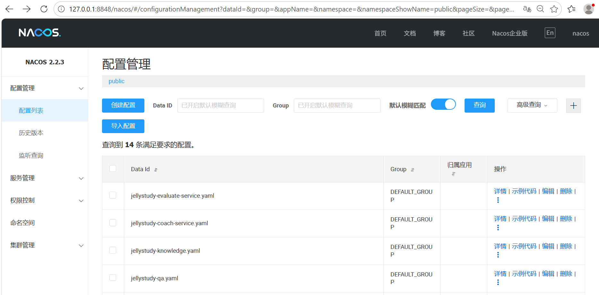
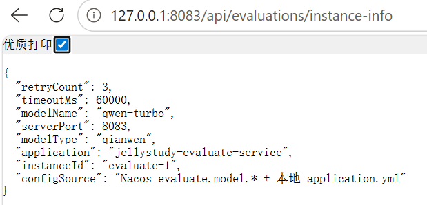
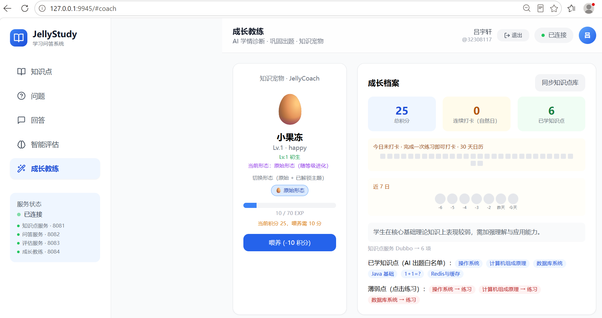

# 移动应用系统架构设计 — 实验报告（第十二周）

**课程号**：C01215  
**实验名称**：微服务容器化与部署实验  
**学号**：32308117  
**姓名**：吕宇轩  
**工程名**：jellystudy  
**实验日期**：2026 年 5 月  

---

## 一、实验目的

1. 掌握 **Docker** 打包与部署，实现**一个微服务两个实例**（评估服务 evaluate-1 / evaluate-2）。
2. 掌握 **Nacos 配置中心**，实现业务参数（含 **AI 大模型**相关配置）的动态读取与热刷新。
3. 在 JellyStudy 平台上**设计并实现独立模块 JellyCoach 智能成长教练**，综合运用 Spring Boot、Dubbo 3、MongoDB、Redis、RabbitMQ、DashScope 千问、SkyWalking 调用链与 Docker。
4. 理解 **Dubbo 3 元数据注册**（registry + metadata-report + config-center）的标准化流程。

---

## 二、实验环境

| 组件 | 版本 / 端口 |
|------|-------------|
| JDK | 17 |
| Spring Boot | 3.2.11 |
| Spring Cloud | 2023.0.3 |
| Apache Dubbo | 3.2.7（Triple 协议） |
| Nacos | 2.2.3（Docker :8848，`nacos`/`nacos`） |
| MySQL | 8.0（Docker :3307） |
| Redis | 7（Docker :6379，密码 `jellystudy_redis`） |
| MongoDB | 7（Docker :27017，库 `jellystudy_coach`） |
| RabbitMQ | 3（:5672，管理台 :15672） |
| SkyWalking | OAP/UI :8090 |
| Gateway | 8080（评估路由 `lb://jellystudy-evaluate`，profile `dual` 轮询 8083+8085） |
| Evaluate | **8083**、**8085**（双实例） |
| Coach | 8084 |
| QA / Knowledge | 8082 / 8081 |
| 前端 | Vue 3 + Vite :9945 |
| 大模型 | 阿里云 DashScope 千问（`qwen-turbo`，Mock 降级） |

---

## 三、实验内容与原理

### 3.1 作业一：Docker 双实例 + Nacos 配置

#### 3.1.1 Docker 双实例原理

同一镜像 `jellystudy-evaluate-service` 通过环境变量区分实例。**推荐一键 Docker 全栈**：

```powershell
# 编译 + 基础设施 + 五服务 + Gateway + SkyWalking Agent
docker compose up -d --build
# 或
start-docker-services.bat
```

所有 Java 容器内置 SkyWalking Agent（`docker/Dockerfile.jvm-service`），Trace 可在 http://127.0.0.1:8090 查看。Gateway 使用 `SPRING_PROFILES_ACTIVE=docker`，自动轮询 `evaluate-1:8083` 与 `evaluate-2:8085`。

| 容器/进程 | INSTANCE_ID | SERVER_PORT | DUBBO_PROTOCOL_PORT | 说明 |
|-----------|-------------|-------------|---------------------|------|
| evaluate-1 | evaluate-1 | 8083 | 50053 | 主实例 |
| evaluate-2 | evaluate-2 | 8085 | 50055 | 第二实例 |

**本地双实例**：`scripts/start-full-stack.ps1` 在启动五服务后，以相对路径 `java -jar target/...jar` 拉起 evaluate-2（规避中文路径问题），并重启 Gateway 为 `dual` profile。

**Docker 双实例**：编排文件 `docker-compose.services.yml`，启动命令：

```powershell
docker compose -f docker-compose.core.yml -f docker-compose.services.yml up -d --build
```

**负载均衡**：

- Dubbo 层：两个 Provider 实例注册至 Nacos，QA 通过 `@DubboReference IEvaluateService` 客户端负载。
- HTTP 层：Gateway `application-dual.yml` + Spring Cloud LoadBalancer 轮询 8083/8085。

验证：多次请求 `GET http://127.0.0.1:8080/api/evaluations/instance-info`，`instanceId` 在 `evaluate-1` 与 `evaluate-2` 间交替。

#### 3.1.2 Nacos 配置中心原理

Evaluate 与 Coach 通过 Spring Cloud Nacos Config 拉取配置：

```yaml
spring:
  config:
    import:
      - optional:nacos:${spring.application.name}.yaml?group=DEFAULT_GROUP&refreshEnabled=true
```

配置模板位于 `nacos-config/`，一键导入：

```powershell
powershell -File scripts\import-nacos-config.ps1
```

| Data ID | 关键参数 |
|---------|----------|
| `jellystudy-evaluate-service.yaml` | `evaluate.model.type/model-name/timeout/retry-count` |
| `jellystudy-coach-service.yaml` | `coach.growth.*`、`coach.model.model-name/timeout` |

**热刷新**：`@RefreshScope` + `@ConfigurationProperties`（`CoachGrowthProperties`、`CoachModelProperties`、`EvaluateModelProperties`）。Evaluate 侧 `RefreshableModelEngine` 每次评估读取最新模型类型与超时，切换 Mock/千问无需重启。

**安全约定**：`DASHSCOPE_API_KEY` 仅通过环境变量 / `local-secrets.bat` 注入，**不写入 Nacos**。

#### 3.1.3 Dubbo 3 元数据注册标准化流程

Dubbo 3 采用**应用级服务发现**（`register-mode: instance`），在 Nacos 上需配置三元组：

| 配置项 | 作用 |
|--------|------|
| `dubbo.registry` | 注册 Provider 实例（tri://host:port） |
| `dubbo.metadata-report` | 上报接口方法元数据，供 Consumer 订阅 |
| `dubbo.config-center` | Dubbo 运行时动态参数 |

五个 Provider（knowledge / qa / evaluate×2 / coach）均注册至 Nacos `:8848`。协议：**Triple（tri）** + `serialization: fastjson2`。

调用规范（见 `docs/DUBBO_ARCHITECTURE.md`）：

- HTTP → 本地 `*ServiceImpl`
- 跨服务 → `@DubboReference`
- 对外 → `@DubboService(version="1.0.0", protocol="tri")`

---

### 3.2 作业二：JellyCoach 模块设计

#### 3.2.1 目标描述

在「提问 → 大模型评估」闭环之上，增加 **评估 → AI 学情诊断 → 巩固练习 → 积分激励 → 知识宠物成长** 链路。利用 RabbitMQ 解耦评估高峰，MongoDB 存储成长档案，Redis 缓存今日任务与排行榜，DashScope 驱动诊断/出题/批改/苏格拉底/周报。

#### 3.2.2 功能描述

| 编号 | 功能 | 技术要点 |
|------|------|----------|
| F1 | 学情画像 | 汇总评估 + AI 薄弱点 Top3（限定知识点 Dubbo 白名单） |
| F2 | 每日任务 | Redis 缓存，任务数来自 Nacos `coach.growth.daily-goal-count` |
| F3 | AI 巩固出题 | DashScope，薄弱点来自用户知识点库 |
| F4 | AI 练习批改 | 提交后打分 + 积分，高分额外奖励 |
| F5 | 学习周报 | Markdown + ECharts 积分趋势 + 真实掌握度 |
| F6 | 知识宠物 | MongoDB 状态，Lv.1–5 进化，主题皮肤 |
| F7 | 苏格拉底对话 | 多轮 history + 三级提示 + 总结存 MongoDB |
| F8 | 排行榜 | Redis ZSET |
| F9 | 登录鉴权 | MongoDB 用户 + Redis Token，Coach API Bearer 鉴权 |

#### 3.2.3 架构图

```text
浏览器 :9945
    │ Bearer Token
    ▼
Gateway :8080  ──lb──► Evaluate :8083 / :8085
    ├─► Knowledge :8081
    ├─► QA :8082 ──Dubbo──► Evaluate（异步评估）
    └─► Coach :8084
              ▲
              │ RabbitMQ jelly.coach.evaluation.completed
              │
         Evaluate :8083 完成评估后发布事件
              │
              ├──► DashScope HTTP（千问）
              ├──► MongoDB（档案/宠物/Quiz/苏格拉底）
              ├──► Redis（任务/打卡/排行）
              └──► Dubbo ──► Knowledge（知识点白名单）
                            Evaluate（苏格拉底评分）

基础设施：MySQL | Redis | Nacos | MongoDB | RabbitMQ | SkyWalking
```

---

## 四、实验设计

### 4.1 第十二周工程优化（超额完成项）

在作业要求基础上，本轮对工程进行了以下打磨：

| 优化项 | 实现 | 价值 |
|--------|------|------|
| 深度健康检查 | `jellystudy-common` 新增 `HealthProbe` 体系，`GET /api/health` 返回 `components`（mysql/redis/mongodb/rabbitmq） | 前端顶栏可展示组件级状态；`DEGRADED` 表示部分依赖不可用 |
| 探针条件装配 | 按依赖拆分为 4 个 AutoConfiguration，类级 `@ConditionalOnClass(name=...)` + `@AutoConfigureAfter` | 避免无 Rabbit/Mongo 的服务启动失败 |
| 固定实例 ID | `jellystudy.instance.id: ${INSTANCE_ID:evaluate-1}` | 双实例演示可识别，不再随机 UUID |
| Gateway 健康路由负载 | `health-evaluate` 改为 `lb://jellystudy-evaluate` | 与业务路由一致的双实例探测 |
| 前端错误 UX | `extractApiError.js` 统一解析 502/503/500；问答/评估面板增加「重试」 | 服务冷启动时用户可自助恢复 |
| 启动脚本加固 | 各服务 cmd 显式 `SERVER_PORT`；evaluate-2 相对路径 + SkyWalking Agent | Windows 路径/端口串扰 |
| Docker 全栈 + SW Agent | `docker compose up -d` 五服务 + Gateway + 内置 Agent | 纯 Docker 可演示 Trace 与 Gateway LB |
| Knowledge Dubbo 显式配置 | `KnowledgeDubboConfiguration` 注册 `ApplicationConfig` | 修复 STRICT 模式下 knowledge 启动失败 |
| 验证脚本 | `verify-z12-demo.ps1` 增加 components 健康检查 | 一键验收第十二周全部要点 |

**健康检查响应示例（QA 服务）**：

```json
{
  "status": "UP",
  "service": "jellystudy-qa",
  "components": {
    "mysql": "UP",
    "redis": "UP"
  },
  "timestamp": 1779699203925
}
```

**instance-info 响应示例**：

```json
{
  "instanceId": "evaluate-1",
  "serverPort": 8083,
  "application": "jellystudy-evaluate-service",
  "modelType": "qianwen",
  "modelName": "qwen-turbo",
  "timeoutMs": 60000,
  "retryCount": 3,
  "configSource": "Nacos evaluate.model.* + 本地 application.yml"
}
```

**Coach 配置接口** `GET /api/coach/config`：

```json
{
  "dailyGoalCount": 3,
  "pointsPerTask": 10,
  "pointsHighScore": 5,
  "streakBonus": 50,
  "modelName": "qwen-turbo",
  "modelTimeoutMs": 60000,
  "source": "Nacos coach.growth.* + coach.model.*（@RefreshScope 热更新）"
}
```

### 4.2 核心代码说明

| 模块 | 类/文件 | 职责 |
|------|---------|------|
| Common | `JellystudyHealthController` | 统一 `/api/health`，聚合探针 |
| Common | `*HealthProbeAutoConfiguration` | 按依赖条件注册 mysql/redis/mongo/rabbit 探针 |
| Evaluate | `EvaluateModelProperties` | Nacos 热刷新 AI 模型参数 |
| Evaluate | `RefreshableModelEngine` | 每次调用按最新配置选择千问/Mock |
| Evaluate | `EvaluationController` | `GET /api/evaluations/instance-info` |
| Evaluate | `EvaluateInstanceProperties` | 读取 `INSTANCE_ID` 环境变量 |
| Knowledge | `KnowledgeDubboConfiguration` | 显式 Dubbo ApplicationConfig，保障启动稳定 |
| Coach | `CoachGrowthProperties` / `CoachModelProperties` | Nacos 热刷新积分规则与模型 |
| Coach | `CoachAiEngine` | DashScope 诊断/出题/批改/苏格拉底 |
| Coach | `EvaluationEventConsumer` | MQ 消费 → 积分 |
| Gateway | `application-dual.yml` | 双 evaluate 实例 Simple Discovery |
| 运维 | `scripts/start-full-stack.ps1` | 五服务 + evaluate-2 + Gateway dual |
| 运维 | `scripts/verify-z12-demo.ps1` | 第十二周一键验证 |

### 4.3 数据结构设计

**MongoDB — growth_profiles**

| 字段 | 说明 |
|------|------|
| userId | 用户 ID（唯一索引） |
| knowledgeScope | Dubbo 同步的知识点白名单 |
| weakPoints | AI 诊断薄弱点 |
| totalPoints / streak | 积分与连续打卡 |
| knowledgeMastery | 真实掌握度（Quiz + 苏格拉底聚合） |

**Redis**

| Key | 类型 | 说明 |
|-----|------|------|
| `jelly:coach:tasks:{userId}:{date}` | STRING | 今日任务 JSON |
| `jelly:coach:streak:{userId}` | STRING | 连续打卡天数 |
| `jelly:coach:checkin:{userId}` | SET | 打卡日期集合 |
| `jelly:coach:leaderboard` | ZSET | 积分排行榜 |

**RabbitMQ**

- Exchange/Queue：`jelly.coach.evaluation.completed`
- 消息体：`EvaluationCompletedEvent`（含 userId、score、questionId）

---

## 五、运行与验证

### 5.1 启动顺序

```powershell
# 1. 基础设施（需先启动 Docker Desktop）
docker compose -f docker-compose.core.yml up -d

# 2. 导入 Nacos 配置
powershell -File scripts\import-nacos-config.ps1

# 3. 编译
cd jellystudy-parent
mvn clean package -DskipTests

# 4. 一键全栈（五服务 + evaluate-2 + Gateway dual）
powershell -File scripts\start-full-stack.ps1

# 5. 前端
cd frontend
npx vite --host 127.0.0.1 --port 9945
```

### 5.2 验证脚本

```powershell
powershell -File scripts\verify-z12-demo.ps1
```

**预期输出要点**：

- Nacos 两个 yaml 导入成功
- `8083` instance-info 返回 `evaluate-1`
- `8085` instance-info 返回 `evaluate-2`（若第二实例已启动）
- Gateway 轮询 instance-info 可见两个 instanceId 交替
- `/api/coach/config` 返回 Nacos 中的 growth/model 参数
- 各服务 `/api/health` 的 `components` 中对应中间件为 `UP`

### 5.3 功能自测清单

- [ ] Nacos 配置列表存在两个 yaml
- [ ] `8083` 与 `8085` instance-info 返回不同 `instanceId`
- [ ] Gateway 轮询 instance-info 可见两个实例（dual profile）
- [ ] Nacos 修改 `daily-goal-count` → `/api/coach/config` 数值变化
- [ ] 前端顶栏 health tooltip 显示 mysql/redis 等组件状态
- [ ] 登录 → 成长教练 → 薄弱点练习 → AI 出题 → 提交得分
- [ ] 提交回答 → 评估 → MQ → Coach 积分增加（对应登录用户）
- [ ] SkyWalking Trace：MQ → Coach → HTTP DashScope
- [ ] Dubbo：Nacos 服务列表可见 4+ Provider

---

## 六、运行效果截图

> 将 PNG 保存至 `docs/screenshots/`，文件名与下表一致。  
> 操作步骤见 `docs/截图操作指南.md`。

### 6.1 第十二周新增截图

| 序号 | 文件名 | 说明 |
|------|--------|------|
| Z12-1 | `z12-nacos-config.png` | Nacos 配置管理 — 两个 Data ID |
| Z12-2 | `z12-instance-info-8083.png` | evaluate-1 instance-info |
| Z12-3 | `z12-instance-info-8085.png` | evaluate-2 instance-info |
| Z12-4 | `z12-gateway-lb.png` | Gateway 多次请求 instance-id 不同 |
| Z12-5 | `z12-coach-config.png` | `/api/coach/config` 返回 Nacos 参数 |
| Z12-6 | `z12-coach-panel.png` | 成长教练页（宠物/薄弱点/周报） |
| Z12-7 | `z12-nacos-refresh.png` | 修改 Nacos 后 config 接口变化 |
| Z12-8 | `z12-health-components.png` | `/api/health` 返回 components 探针 |
| Z12-9 | `z12-skywalking-mq-coach.png` | Trace：MQ → Coach → DashScope |
| Z12-10 | `z12-docker-ps.png` | `docker ps` 显示 evaluate-1/2 |

### 6.2 延续第十一周截图

| 文件名 | 说明 |
|--------|------|
| `01-nacos-services.png` | Dubbo Provider 注册 |
| `02-question-hot-viewed.png` | Redis 热门/常看 |
| `03-evaluate-qianwen.png` | 千问评估结果 |
| `06-skywalking-trace-evaluate.png` | 评估 Dubbo Trace ~2s |







---

## 七、实验效果说明

### 7.1 Docker 双实例

两个 evaluate 进程/容器共享同一 MySQL 评估库与 Redis，Dubbo 在 Nacos 注册为同一应用的两个实例。HTTP 层通过 Gateway `lb://jellystudy-evaluate` + profile `dual` 实现轮询，满足「一个服务两个实例」要求。

### 7.2 Nacos 配置与 AI

- **业务参数**：每日任务数、积分规则由 Nacos 管理，修改后 `@RefreshScope` Bean 刷新，无需改代码发版。
- **AI 参数**：`model-name`、`timeout` 存 Nacos；`RefreshableModelEngine` 每次评估读取最新配置。
- **密钥**：API Key 走环境变量，符合生产安全规范。

### 7.3 JellyCoach 闭环

用户提交回答 → Evaluate 异步千问评分 → RabbitMQ 事件 → Coach 按 **author** 加积分 → 前端周报/宠物/掌握度更新。知识点范围通过 Dubbo 从 Knowledge 服务同步，AI 不出库。

### 7.4 工程优化成效

- **可观测性**：深度 health 让「服务 UP 但 Redis 挂了」这类问题在前端顶栏即可发现。
- **可运维性**：`start-full-stack.ps1` + `verify-z12-demo.ps1` 降低答辩演示翻车概率。
- **可维护性**：探针按依赖条件装配，common 模块可被 knowledge/qa/evaluate/coach 安全复用。

---

## 八、实验总结

1. **容器化**：Docker Compose 将基础设施与 evaluate 双实例、coach 统一编排，环境可复现。
2. **配置中心**：Nacos 将「易变参数」与代码分离；AI 模型名/超时/积分规则可运维侧调整。
3. **Dubbo 3**：应用级注册 + 元数据上报是云原生 RPC 标准路径，与 Spring Cloud Gateway 负载互补。
4. **事件驱动**：RabbitMQ 解耦评估与 Coach，避免同步调用链路过长。
5. **工程体会**：双实例部署需同时考虑 **Dubbo 层**与 **HTTP 层**负载；Windows 本地开发需注意 `SERVER_PORT` 环境变量泄漏与中文路径对 `java -jar` 的影响。

**个人收获**：通过 JellyCoach 模块将课程分散知识点（微服务、缓存、消息、AI、配置中心、容器）整合为可演示的完整产品链路；第十二周优化使系统在「能跑」之上进一步达到「可观测、可验证、可演示」。

---

## 九、附录

### 9.1 提交物清单

| 文件 | 说明 |
|------|------|
| `32308117_吕宇轩.docx` | 本报告 Word 版（由本文粘贴编辑） |
| `32308117_jellystudy.zip` | `package-project.bat` 打包源码 |

### 9.2 关键文件索引

| 路径 | 说明 |
|------|------|
| `docker-compose.services.yml` | evaluate 双实例 + coach |
| `nacos-config/*.yaml` | Nacos 配置模板 |
| `scripts/import-nacos-config.ps1` | 配置导入 |
| `scripts/start-full-stack.ps1` | 全栈一键启动 |
| `scripts/verify-z12-demo.ps1` | 第十二周验证 |
| `jellystudy-common/.../health/` | 深度健康探针 |
| `docs/大作业-JellyCoach模块设计.md` | 模块设计详述 |
| `docs/DUBBO_ARCHITECTURE.md` | Dubbo 调用规范 |

### 9.3 访问地址

| 用途 | URL |
|------|-----|
| 前端 | http://127.0.0.1:9945/ |
| Nacos | http://127.0.0.1:8848/nacos |
| instance-info | http://127.0.0.1:8083/api/evaluations/instance-info |
| 深度健康 | http://127.0.0.1:8082/api/health |
| Coach 配置 | http://127.0.0.1:8084/api/coach/config |
| SkyWalking | http://127.0.0.1:8090/ |

---

**报告完成日期**：2026 年 5 月  
**学生签名**：吕宇轩（32308117）
